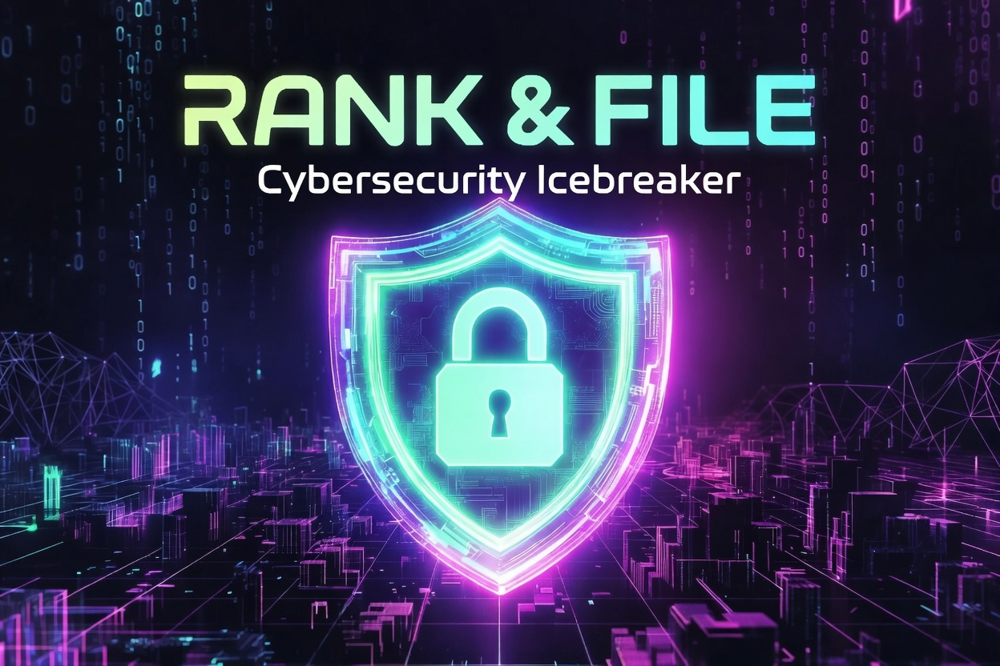

# Rank & File — Cybersecurity Edition

**A high-energy, real-time icebreaker game** where players rank cybersecurity concepts by personal importance, guess how others ranked them, and debate the spicy topics that divide us.

Built for team-building, security awareness workshops, virtual happy hours, and cybersecurity conferences.

## [PLAY HERE!](https://red-bush-0db18090f.7.azurestaticapps.net/)



## 🎯 Purpose

**Rank & File** turns serious cybersecurity topics into fun, thoughtful conversations. 

By ranking 5 security nouns every round and then guessing how your paired teammate ranked them, players:
- Reveal their personal security priorities
- Discover surprising differences in thinking
- Debate controversial “spicy” topics (Government Backdoors, Mass Surveillance, Privacy vs Security, etc.)
- Build real connections in a short time

Perfect for **6–60 players**. Runs in ~25–35 minutes (5 fast rounds).

## 🎮 How to Play

### Game Flow (5 Rounds)

1. **Lobby**  
   Host creates a session → shares the 6-character code. Players join with their name.

2. **Ranking Phase (30 seconds)**  
   Everyone receives the **same 5 cybersecurity cards**.  
   Drag & drop to rank them from **most important → least important** to you personally.  
   Auto-submits at 30 seconds.

3. **Guessing Phase (45 seconds)**  
   You are secretly paired with **a new person every round** (no repeat pairings until necessary).  
   - Even number of players → 1-on-1 pairs  
   - Odd number → one group of 3 in a guessing cycle (A guesses B, B guesses C, C guesses A)

   Guess how your partner ranked the 5 cards.

4. **Results & Scoring**  
   - Exact card + exact position = **3 points**  
   - Adjacent position (off by 1) = **1 point**  
   Scores are added to your total.

5. **Leaderboard**  
   Live leaderboard after every round. Highest total score wins!

### The Cards

Every round you get:
- 3–4 **standard** cybersecurity terms (Firewall, Zero Trust, Ransomware, etc.)
- **1–2 spicy / controversial** terms (Government Backdoor, Mass Surveillance, Encryption Backdoor, Privacy vs Security, etc.)

The spicy cards are designed to spark debate and hilarious guessing mismatches.

---

## 🛠 Tech Stack

- **Frontend**: Next.js 15 + Tailwind + @dnd-kit (neon cyberpunk design)
- **Backend**: ASP.NET Core 8 + SignalR (real-time)
- **Database**: Azure Cosmos DB
- **Real-time**: Azure SignalR Service
- **Hosting**: Azure Static Web Apps + App Service

---

## 🚀 One-Click Deployment

```bash
azd auth login
azd up
